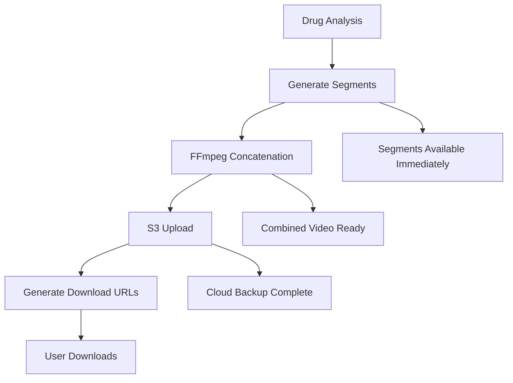

# Enhanced Video Generation and Storage System

This document describes the enhanced video generation system that adds professional video concatenation using FFmpeg.wasm and cloud storage with AWS S3.

## New Features

### 🎥 Professional Video Concatenation
- **FFmpeg.wasm Integration**: Proper MP4/WebM video concatenation with consistent codecs
- **Multiple Quality Options**: High, medium, and low quality settings
- **Format Support**: Both MP4 (H.264) and WebM (VP9) output formats
- **Audio Preservation**: Maintains audio tracks during concatenation
- **Browser Compatibility**: Works across all modern browsers

### ☁️ AWS S3 Cloud Storage
- **Automatic Upload**: Generated videos uploaded to S3 for persistence
- **Individual Segments**: Option to store each video segment separately
- **Presigned URLs**: Secure, expiring download links
- **Thumbnail Generation**: Automatic video thumbnail creation and storage
- **Organized Structure**: Videos stored with drug name and date organization

### 📥 Enhanced Download System
- **Multiple Formats**: Download in MP4, WebM, or original format
- **Quality Options**: Choose from high, medium, or low quality downloads
- **Batch Downloads**: Download individual segments or create format packages
- **Share URLs**: Generate secure sharing links with expiration
- **Progress Tracking**: Real-time download and conversion progress

## Setup Instructions

### 1. AWS S3 Configuration

#### Create S3 Bucket
1. Go to [AWS S3 Console](https://s3.console.aws.amazon.com/)
2. Click "Create bucket"
3. Choose a unique bucket name (e.g., `my-app-video-storage`)
4. Select your preferred region
5. Configure bucket settings:
   - **Public Access**: Block all public access (use presigned URLs)
   - **Versioning**: Enable if desired
   - **Encryption**: Enable server-side encryption

#### Set Bucket CORS Policy
Add this CORS configuration to allow web uploads:

```json
[
    {
        "AllowedHeaders": ["*"],
        "AllowedMethods": ["PUT", "POST", "GET"],
        "AllowedOrigins": ["http://localhost:3000", "https://yourdomain.com"],
        "ExposeHeaders": ["ETag"],
        "MaxAgeSeconds": 3000
    }
]
```

#### Create IAM User
1. Go to [AWS IAM Console](https://console.aws.amazon.com/iam/)
2. Create a new user with programmatic access
3. Attach this policy (replace `YOUR_BUCKET_NAME`):

```json
{
    "Version": "2012-10-17",
    "Statement": [
        {
            "Effect": "Allow",
            "Action": [
                "s3:PutObject",
                "s3:GetObject",
                "s3:DeleteObject",
                "s3:HeadObject"
            ],
            "Resource": "arn:aws:s3:::YOUR_BUCKET_NAME/*"
        }
    ]
}
```

### 2. Environment Variables

Update your `.env` file with the following:

```bash
# AWS Configuration
VITE_AWS_ACCESS_KEY_ID=your_access_key_id
VITE_AWS_SECRET_ACCESS_KEY=your_secret_access_key
VITE_AWS_REGION=us-east-1
VITE_AWS_S3_BUCKET_NAME=your-bucket-name

# Video Processing Settings
VITE_VIDEO_QUALITY_DEFAULT=medium
VITE_VIDEO_FORMAT_DEFAULT=mp4
VITE_S3_UPLOAD_ENABLED=true
VITE_S3_PRESIGNED_URL_EXPIRATION_MINUTES=60
```

### 3. Testing the Setup

1. Start the development server: `npm run dev`
2. Upload a medication or enter a drug name
3. Click "Visualize" to generate a video
4. Check the browser console for S3 upload status
5. Try downloading the video in different formats

## Architecture Overview

### File Structure
```
src/lib/api/
├── ffmpeg-processor.ts          # FFmpeg.wasm video concatenation
├── s3-service.ts               # AWS S3 upload/download operations
├── enhanced-video-manager.ts   # Orchestrates entire video pipeline
└── download-manager.ts         # Handles all download operations
```

### Video Generation Pipeline

1. **Analysis Stage**: AI analyzes drug mechanism
2. **Script Generation**: Enhanced prompts for video creation
3. **Segment Generation**: 4 video segments created individually
4. **Concatenation**: FFmpeg.wasm combines segments into final video
5. **Cloud Upload**: Video and thumbnails uploaded to S3
6. **Download Ready**: Multiple download options available

### Processing Flow



## Usage Examples

### Basic Video Generation
```typescript
import { generateDrugVideo } from '@/lib/api/enhanced-video-manager';

const result = await generateDrugVideo('Aspirin', {
    quality: 'high',
    format: 'mp4',
    uploadToS3: true,
    generateThumbnail: true
});
```

### Download Options
```typescript
import { downloadVideoFile } from '@/lib/api/download-manager';

await downloadVideoFile(videoResult, {
    format: 'mp4',
    quality: 'high',
    source: 's3'
});
```

### Share URL Generation
```typescript
import { createShareUrl } from '@/lib/api/download-manager';

const shareUrl = await createShareUrl(videoResult, 60); // 60 minute expiration
```

## Performance Optimizations

### Video Processing
- **Parallel Processing**: Segments generated concurrently
- **Progressive Loading**: FFmpeg.wasm loads on-demand
- **Memory Management**: Automatic cleanup of temporary files
- **Timeout Protection**: Prevents hanging operations

### Cloud Storage
- **Conditional Upload**: Only uploads if S3 is configured
- **Presigned URLs**: Secure access without exposing credentials
- **Organized Structure**: Efficient file organization by drug/date
- **Compression**: Optimized video settings for web delivery

## Browser Compatibility

### FFmpeg.wasm Requirements
- **Chrome/Edge**: 57+ (full support)
- **Firefox**: 52+ (full support)
- **Safari**: 11+ (requires SharedArrayBuffer)
- **Mobile**: iOS 11.3+, Android Chrome 60+

### Fallback Behavior
- If FFmpeg.wasm fails, individual segments remain playable
- S3 upload continues independently of concatenation
- Download options adapt to available features

## Troubleshooting

### Common Issues

1. **S3 Upload Fails**: Check AWS credentials and bucket permissions
2. **FFmpeg Loading Fails**: Verify HTTPS and modern browser
3. **CORS Errors**: Update S3 bucket CORS policy
4. **Memory Issues**: Use lower quality settings for large videos

### Debug Mode
Enable detailed logging:
```typescript
// Add to browser console
localStorage.setItem('video-debug', 'true');
```

### Performance Monitoring
```typescript
// Check processing times
console.log('Video processing time:', result.processingTime);
console.log('S3 upload time:', result.s3Upload?.uploadTime);
```

## Security Considerations

### Frontend Limitations
- **Never expose AWS secrets**: Use IAM policies with minimal permissions
- **Presigned URLs**: Limit access duration and scope
- **CORS Configuration**: Restrict allowed origins
- **Rate Limiting**: Implement on server-side for production

### Production Recommendations
- Use backend proxy for AWS operations
- Implement user authentication
- Add usage quotas and billing
- Monitor S3 costs and usage patterns

## API Reference

See individual TypeScript files for detailed API documentation:
- [FFmpeg Processor](./src/lib/api/ffmpeg-processor.ts)
- [S3 Service](./src/lib/api/s3-service.ts)
- [Enhanced Video Manager](./src/lib/api/enhanced-video-manager.ts)
- [Download Manager](./src/lib/api/download-manager.ts)